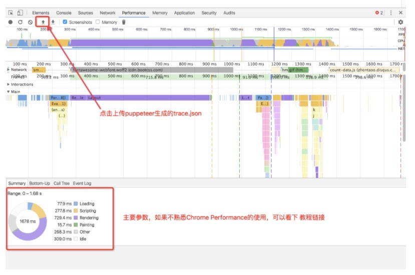

#### 简单介绍 Trace API
> Trace API其实很简单，主要是使用Chrome Performance，生成当前页面的 性能追踪 文件， 然后将该文件上传给Chrome，就可以利用Chrome的开发者工具分析火焰图、各种数据参数

####  API: 使用 tracing start，stop生成trace.json
```
await page.tracing.start({path: './data/trace/trace.json'});
await page.goto('http://www.zhentaoo.com');
await page.tracing.stop();

```

#### 将trace.json上传给chrome，如下图

